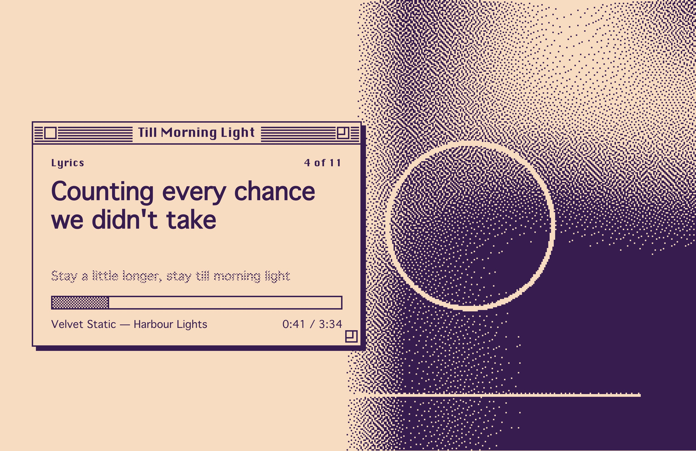
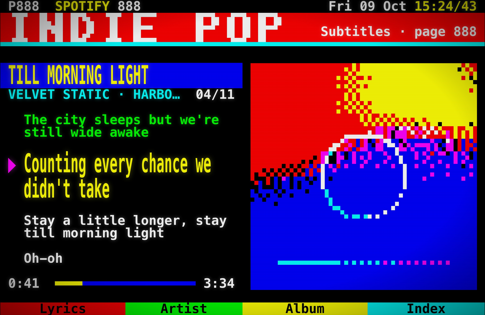
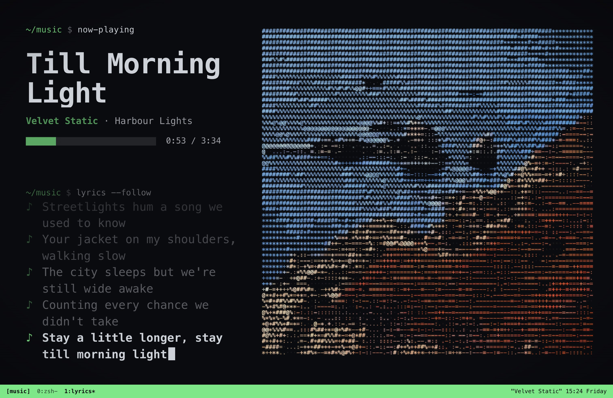
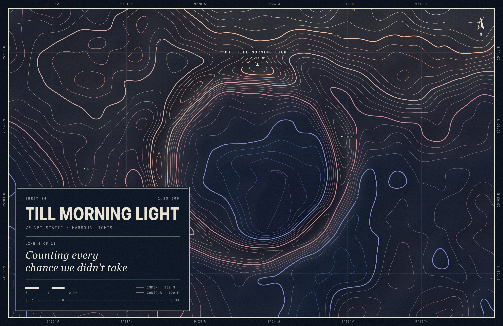
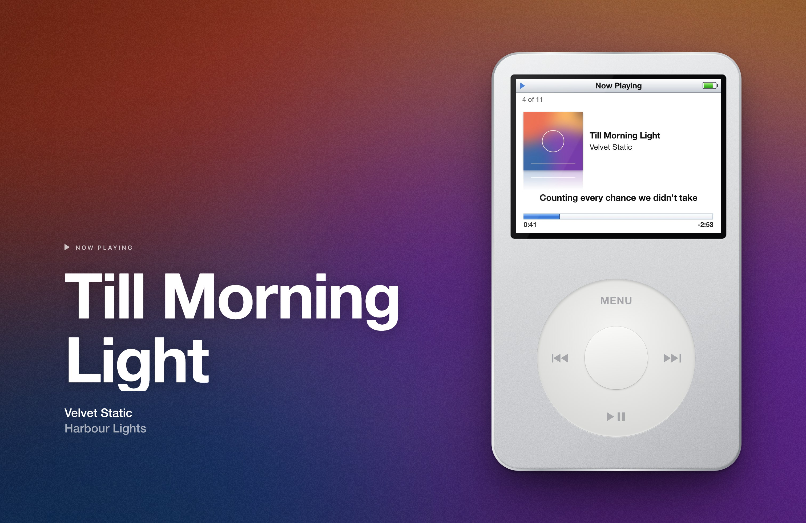
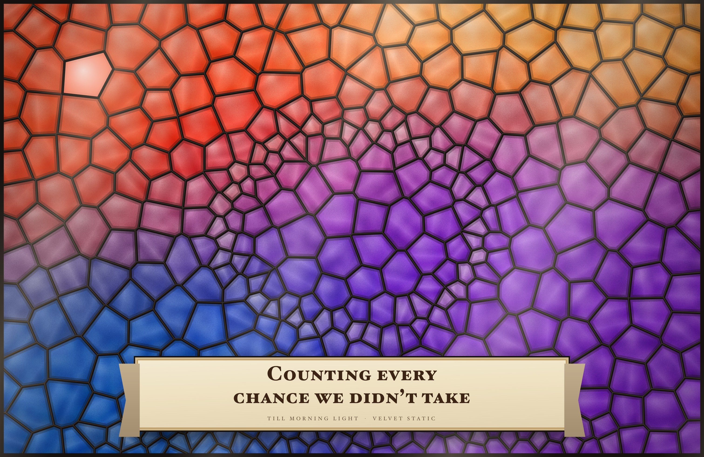

# Spotify Wallpaper

A macOS menu bar app that turns your desktop into whatever Spotify is playing: the cover art plus **live, synced
lyrics** that animate line by line, on every Space and every monitor. Designs are HTML/CSS templates you can tweak
with sliders or rewrite completely.

<p align="center">
  
  
  
  
  
  
  
  
  
  
  
  
  
  
  
  
  
  
  
  
  
  
  
</p>

## Features

- **Synced lyrics from four sources:** [LRCLIB](https://lrclib.net), NetEase Cloud Music, QQ Music and Kugou, searched
  in parallel. The app matches lines across sources and uses the **median timestamp** for each one, so a single
  badly timed source gets outvoted, and a source synced to a different version of the song is dropped. Each line
  changes on its exact timestamp, with optional karaoke-style fill.
- **Animated:** lyrics scroll and rise in, the waveform moves, gradients drift. You can cap the frame rate to save battery.
- **Every Space, every monitor.** Each display gets a frame drawn at its own size and aspect ratio (laptop and ultrawide).
- **The real wallpaper stays in sync.** On every track change the app also sets your actual wallpaper to a still of
  the song, so the lock screen and Mission Control match. When you quit, or nothing is playing, your own wallpaper
  comes back.
- **Twenty-eight built-in templates:** Lyric Card (Spotify lyric cards), Album Poster (minimalist posters with color swatches),
  Minimal, Glow (Apple Music style), Vinyl (a spinning record with the cover as its label), Typewriter (lyrics type
  themselves out), Lock Screen (big live clock), Visualizer (bars in the cover's colors), Brushwork (a living oil
  painting made from the cover with p5.js brushes) and Painted Cover / Painted Cover Wide (the cover repainted in
  sharp knife strokes, with the song in Helvetica), Cassette (a mixtape whose reels wind through the song, with the
  current line handwritten on its label), Liner Notes (the CD booklet: the whole song typeset beside the cover) and
  Weather & Time (a sky that follows your time of day and weather, with rain running down the glass), Departure
  Board (each line clatters in on a split-flap board under a dot-matrix title), Riso Print (the cover as two-ink
  halftone, a hair out of register on every line), Swiss Grid (the lyric set huge on a twelve-column grid), Hardware
  Panel (a little device with the cover behind a speaker grille, the lyric on an OLED and knobs that turn with the
  song), Film Strip (35 mm frames that advance a frame per line, under a yellow subtitle), Albers (the cover's four
  strongest colours as nested squares that trade places each line), Breathing Type (the key word's width swells with
  the beat), Receipt (the song printing on a thermal slip, line by line), One Bit (the cover dithered to two inks
  beside a System 7 window), Teletext (Page 888 with the cover rebuilt from mosaic blocks), Text Mode (the cover in
  coloured ASCII, the lyric typed at a shell prompt), Contour Map (the cover's brightness surveyed as terrain, with a
  summit named after the song), Classic (an iPod classic on its Now Playing screen) and Stained Glass (the cover cut
  into leaded panes of glass, the lyric on a parchment banner).
- **Duets and translations:** templates can lay out duets voice by voice and show translated lyrics under each line,
  and lyrics hide while you share your screen.
- **Light on your Mac:** about 1–5% CPU while animating at 60 fps. Lines change on timers set for their exact
  timestamps, animations run on the GPU, the cover is blurred once per song, and everything pauses when windows cover
  the desktop.
- **Colors from the cover:** every template can follow each song's palette automatically.
- **Template Builder:** a Figma-style editor for designing your own wallpaper with no code. Draw text, lyrics, the
  cover, images, shapes, a vinyl record, a progress bar, a waveform and color swatches on a live canvas; style them;
  add motion; then **Edit Code** to keep going in HTML/CSS.
- **Customizable:** each template's settings (colors, fonts, sizes, lines shown, blur, grain, animation) appear in
  the app's Home window next to a live preview. You can also duplicate a template and edit its HTML/CSS directly; it
  reloads as you save.
- **No login or API key.** It reads the Spotify desktop app directly.

<p align="center"></p>

See what changed in each version in the **[changelog](CHANGELOG.md)**, or in the app under **What's New…**.

## Install

1. Download **Spotify-Wallpaper-x.y.zip** from the [latest release](../../releases/latest) and unzip it.
2. Move **Spotify Wallpaper.app** to **/Applications**.
3. The app isn't notarized by Apple, so the first time, **right-click it → Open → Open**. Or run:
   ```sh
   xattr -dr com.apple.quarantine "/Applications/Spotify Wallpaper.app"
   ```
4. When macOS asks whether Spotify Wallpaper may **control Spotify**, click **OK**. That's how it reads what's playing.

Requires macOS 14 Sonoma or later and the Spotify desktop app. It runs natively on Apple Silicon and Intel.

**Updates install themselves** from v1.2.0 on. The app checks this repo's releases at launch and every 6 hours,
verifies the download (GitHub's SHA-256 checksum, the app's identifier and its code signature), swaps it in and
relaunches. Turn this off under **Automatically Install Updates** in the menu.

**Recommended:** turn on **System Settings → Wallpaper → Show on all Spaces**, so the still wallpaper is shared by
every Space rather than set one Space at a time.

## Use

Everything is in the ♪ menu bar icon:

| Menu item | What it does |
|---|---|
| **Open Spotify Wallpaper… (⌘O)** | Home: a live preview with each template's settings, a shelf of recent and favourite templates, the full gallery, a template per display, the History Wall, and lyrics source and timing. Also opens when you open the app again from Finder or the Dock |
| **Template Builder…** | Design a new template visually, no code |
| **Lyrics** | Nudge this song's timing earlier or later (remembered per song). Pick the source or search again in Home's Lyrics tab |
| **Refresh Rate** | Display maximum, 60, 30 or 15 fps for the animation. Lyric timing is exact at any rate |
| **Pause Wallpaper** | Put your normal wallpaper back until you resume |
| **Open Templates Folder** | Where your own templates live |
| **Launch at Login** | Start automatically |
| **What's New…** | The changelog; it also opens once after each update |
| **Check for Updates…** | Look for a new release now. Turn **Automatically Install Updates** on or off |

## Make your own templates

### Without code: the Template Builder

Open **Template Builder…** from the menu, or **Builder** in the app's window, and start from a layout (Blank, Spotlight, Glass Card,
Headline, Record Room, Analog Clock, Clock).

- **Tools** (bar under the canvas): Move (V), Text (T), Rectangle (R), Ellipse (O), Line (L), Triangle, Star,
  Polygon, Arrow, Image (I), Lyrics (Y), Album Cover (C), Vinyl Record, Progress Bar, Waveform and Color Swatches.
  Pick a tool and drag on the canvas to draw it, or click for a default size. Drop images from Finder onto the canvas.
- **Text** can show the song title, artist, album, the current/next/previous lyric, times, a live **clock** or the
  **date**, or your own words with variables mixed in, e.g. `Now playing {{track.title}} · {{time.clock}}` (the **＋**
  next to the text field lists every variable).
- **Follow time:** make any layer rotate, move, grow or fade with the **song's progress**, **each lyric line**, or
  the **real clock** (seconds, minutes, hours), with a pivot point, so you can build things like analog clock hands
  or an element that travels across the screen as the song plays. The Analog Clock starter shows how.
- **Canvas:** the song that's playing, at the size of each of your screens or of common displays (MacBook Air/Pro,
  iMac, Studio Display, Pro Display XDR, 1080p, 1440p, 1600p, 4K, ultrawide, super-ultrawide, portrait). Drag to move, pull the handles to resize
  (⇧ keeps proportions), with snapping to the center and other layers (⌥ to place freely) and size readouts.
- **Layers:** drag to reorder, double-click to rename, hide and lock. Right-click a layer for arrange, copy, paste,
  duplicate and delete.
- **Design panel:** alignment, position, rotation, size, opacity, corner radius, blend mode, typography, fills
  (solid, gradient, the album cover or an image), colors that follow each song's cover (*Auto*), stroke, drop shadow,
  layer blur, frosted glass, and **Motion** (spin, pulse, float, sway, breathe, blink) that can pause with the music.
- **Background:** blurred cover, a glow from the cover's colors, gradient, image or solid color, plus film grain.
- **Undo/redo, copy/paste, duplicate, nudge with the arrow keys**, and autosave after the first save.
- **Edit Code** turns the design into a plain HTML/CSS template and opens it in your code editor.

Positions are stored as percentages of the screen and sizes relative to it, so one design fits a laptop and an
ultrawide. Designs are saved as normal templates in the templates folder, so they can be shared like any other.

<p align="center">
  
</p>
<p align="center">
  
</p>
<p align="center">
  
  
</p>

### With code

A template is a folder with a `manifest.json` (name and settings) and an `index.html`. The quickest start is
**Open Spotify Wallpaper → pick a template → ⋯ → Duplicate & edit code**. That copies it to
`~/Library/Application Support/Spotify Wallpaper/Templates/`, and the preview and desktop reload every time you save.

```html
<!doctype html>
<html><head>
<meta charset="utf-8">
<link rel="stylesheet" href="/runtime/runtime.css">
<script src="/runtime/runtime.js"></script>
<style>
  body { background: var(--dark); color: #fff; font-family: var(--param-font); }
  lyrics-block .current { font-size: 6vmin; font-weight: 800; }
  lyrics-block .next { opacity: calc(0.5 - var(--dist) * 0.1); }
</style>
</head><body>
  
  <h1 data-bind="track.title|upper"></h1>
  <lyrics-block class="karaoke" layout="center" before="1" after="3"></lyrics-block>
</body></html>
```

Settings declared in `manifest.json` show up as controls automatically:

```json
{
  "name": "My Template",
  "params": [
    { "key": "font", "type": "font", "label": "Font", "default": "New York" },
    { "key": "accent", "type": "color", "label": "Accent", "default": "auto:vibrant" }
  ]
}
```

You get track data (`track.title`, `track.progress`, …), lyrics (`lyrics.current`, `lyrics.next1`,
`lyrics.lineProgress`, …), time (`time.song`, `time.line`, `time.clock`, `time.date`, and `--song-time` /
`--line-time` CSS variables), time-driven animation (`data-follow="song | line | seconds | minutes | hours"` maps a
CSS animation onto the song, the current line or the clock, on the GPU), text with variables
(`data-template="{{track.title}} · {{time.clock}}"`), cover colors (`--vibrant`, `--dominant`, `--p0`…`--p5`, …), smart components
(`<lyrics-block>`, `<fit-text>`, `<swatch-row>`, `<wave-form>`, `<progress-bar>`) and animation hooks. The full
reference is in **[TEMPLATE_GUIDE.md](app/Resources/web/TEMPLATE_GUIDE.md)**, which is also copied into your
templates folder.

### Sharing templates

A template travels as one `.swtemplate` file (the template folder, zipped). In the app's window, open a template's
**⋯** menu and choose **Export “…”…**; send the file to anyone with Spotify Wallpaper, who double-clicks it
(or uses **Import template…**) to install it. Built-in templates export too, so you can share a tuned copy.

To install from the web, link to `spotify-wallpaper://install?url=<https address of a .swtemplate>`. The app
downloads it (https only, up to 25 MB) and asks before installing, showing the template's name and author from its
`manifest.json`.

Every install is checked first: it needs `manifest.json` and `index.html`, may not contain links or paths outside
its folder, and never replaces a template you have. A name that's taken gets a number (“Vinyl 2”). Templates are
web pages, so only install ones from people you trust.

## How it works

```
Spotify app ──notifications + a light check each second, on a background thread──▶ Engine ──▶ lyrics: LRCLIB + NetEase + QQ Music + Kugou → consensus timing
                                           │         cover art → colors via k-means
                                           │
                     ┌─────────────────────┴──────────────────────┐
                     ▼                                            ▼
   Live layer (per screen)                          Still (per screen, on track change)
   WKWebView in a window just above the             same template rendered off-screen, snapshotted
   wallpaper and below the desktop icons,           and set as the real wallpaper via NSWorkspace
   on all Spaces. The template keeps its own
   clock; lines change on timers set for their
   exact timestamps and animations run on the
   GPU compositor.
```

- Lyrics: each source is searched with the track's title, artist and duration, and results must match all three.
  Lines from the synced sources are aligned by text similarity. The best-edited source that agrees with the rest
  provides the text, and every line gets the median time across sources. Sources sharing a catalogue (QQ Music and
  Kugou) count once. Results are cached per song.
- Templates are served from a private `sw://` URL scheme, so they load the shared runtime, the cover and system
  fonts without any local server.
- macOS only sets the wallpaper of the current Space, so the still is re-applied when you switch Spaces. With
  "Show on all Spaces" on, it applies to all of them at once. Each screen alternates between two files, because
  macOS caches wallpapers by path.
- Your original wallpaper is remembered and restored on quit, on pause and when Spotify stops.

## Build from source

Needs Xcode 15+ (Swift 5.9).

```sh
cd app
./build.sh            # build into app/build/
./build.sh install    # build, copy to /Applications and launch
./build.sh release    # universal build + zip for a release
```

See what every lyrics source returns for a song, and the combined timing:

```sh
"app/build/Spotify Wallpaper.app/Contents/MacOS/SpotifyWallpaper" --lyrics "Blinding Lights" "The Weeknd" "After Hours" 200
```

### Releasing

Merging to `main` releases automatically: [`.github/workflows/release.yml`](.github/workflows/release.yml) builds the
universal app on a macOS runner and publishes a GitHub release, and installed copies update themselves from it.

- To pick the version, set it in `app/Info.plist` (e.g. `1.5.0`). Otherwise the patch number is bumped.
- Add a `## <version>` section to `CHANGELOG.md`; it becomes the release notes and shows in **What's New**.
- Only changes under `app/` (or the changelog) trigger a release. You can also run it from the Actions tab.

README screenshots are generated with the bundled sample song:

```sh
"app/build/Spotify Wallpaper.app/Contents/MacOS/SpotifyWallpaper" --screenshots docs/screenshots
```

`prototype/` holds the original Python proof of concept, which drew frames with Pillow. It's kept for reference and
isn't needed by the app.

## Privacy

The app only talks to the Spotify app on your Mac, the lyrics sources (`lrclib.net`, `music.163.com`, `y.qq.com`,
`lyrics.kugou.com`, which receive the song's title, artist, album and duration) and Spotify's image CDN (to
download the cover). Lyric requests are sent without cookies. Nothing else leaves your machine.

## Credits

- Lyrics: [LRCLIB](https://lrclib.net) (a free, open lyrics database), NetEase Cloud Music, QQ Music and Kugou.
- Design inspiration: Spotify lyric cards, minimalist album posters and lyric wallpapers on Pinterest.

Not affiliated with or endorsed by Spotify. Spotify is a trademark of Spotify AB.

## License

[MIT](LICENSE)
